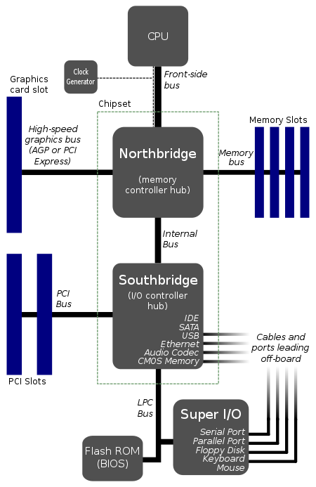

# 대규모 데이터 처리 입문

> 대규모 데이터를 처리하기 위해서 필요한 기초 지식에 대해서 학습합니다.
>
> @강민준(joonamin)

## 대규모 데이터 처리의 어려움

### 쿼리 성능
* `select * from table;` 와 같은 query는 Full table search를 기반으로 한다.
  * 이러한 탐색에서, 레코드의 수가 일정 수치 이상을 넘겨버리면 응답이 반환되지 않는다.
  * 탐색 그 자체에 걸리는 비용이 매우 크기 때문
  * 레코드의 수가 수천만건 이상일 경우, 단순하게 던지는 query에 응답을 기대할 수 없게된다.

### 메모리 내에서 계산 불가능
* 메모리 안에 모든 데이터를 load하지 못한다면, Disk에서 데이터를 Read하고 가져오는 행위를 수행한다 $\rightarrow$ Swapping
  * 디스크 I/O는 메인 메모리 I/O 보다 $10^6$ ~ $10^9$ 정도 느리다.
    * 물리적인 방식을 이용하는 HDD뿐만 아니라, SSD도 느리다
    * [참고](https://superuser.com/questions/1173675/how-much-faster-is-memory-ram-compared-to-ssd-for-random-access)
#### ETC
* Swapping 기법을 통해서, 운영체제는 Page 단위로 Disk에서 데이터를 읽어온다.
* 병목 지점을 최대한 제거하기 위해서, `속도`에 따라서 버스를 구분
  * 

---

* 그 외 多 문제들이 존재하지만, 트러블 슈팅을 계속하여 진행하면서 노하우를 쌓는 것이 탄탄한 기반을 만들어준다.
  * 여러 번의 trial and error 접근 법!!
  * 원인을 끝까지 규정하지 못하는 `원인 불명`의 문제도 존재할 수 있음
    * 기본적인 사항을 파악해두고, `문제가 발생하면 그 자리에서 생각하자`

## Scale-out 의 요소

* 프로그램의 병목 지점을 파악한다. (`"추측하지 말고, 계측하라"`)
  * ex) `Load Average`, `CPU/IO 원인 파악`
    * Load Avergae := 시스템 전체의 성능 

