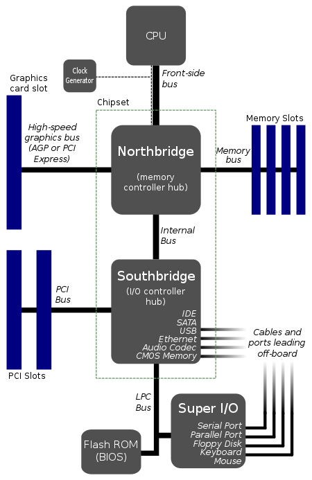

# 대규모 데이터 처리 입문

> 대규모 데이터를 처리하기 위해서 필요한 기초 지식에 대해서 학습합니다.
>
> @강민준(joonamin)

## 대규모 데이터 처리의 어려움

### 쿼리 성능
* `select * from table;` 와 같은 query는 Full table search를 기반으로 한다.
  * 이러한 탐색에서, 레코드의 수가 일정 수치 이상을 넘겨버리면 응답이 반환되지 않는다.
  * 탐색 그 자체에 걸리는 비용이 매우 크기 때문
  * 레코드의 수가 수천만건 이상일 경우, 단순하게 던지는 query에 응답을 기대할 수 없게된다.

### 메모리 내에서 계산 불가능
* 메모리 안에 모든 데이터를 load하지 못한다면, Disk에서 데이터를 Read하고 가져오는 행위를 수행한다 $\rightarrow$ Swapping
  * 디스크 I/O는 메인 메모리 I/O 보다 $10^6$ ~ $10^9$ 정도 느리다.
    * 물리적인 방식을 이용하는 HDD뿐만 아니라, SSD도 느리다
    * [참고](https://superuser.com/questions/1173675/how-much-faster-is-memory-ram-compared-to-ssd-for-random-access)
#### ETC
* Swapping 기법을 통해서, 운영체제는 Page 단위로 Disk에서 데이터를 읽어온다.
* 병목 지점을 최대한 제거하기 위해서, `속도`에 따라서 버스를 구분
  * 

---

* 그 외 多 문제들이 존재하지만, 트러블 슈팅을 계속하여 진행하면서 노하우를 쌓는 것이 탄탄한 기반을 만들어준다.
  * 여러 번의 trial and error 접근 법!!
  * 원인을 끝까지 규정하지 못하는 `원인 불명`의 문제도 존재할 수 있음
    * 기본적인 사항을 파악해두고, `문제가 발생하면 그 자리에서 생각하자`

## Scale-out 의 요소

* 프로그램의 병목 지점을 파악한다. (`"추측하지 말고, 계측하라"`)
  * ex) `Load Average`, `CPU/IO 원인 파악`
    * Load Average := 시스템 전체의 성능 
    	* (실행 가능 상태의 task + I/O 대기 중인 task) / (단위 시간)
    	* 즉, CPU의 실행권한이 부여되기를 기다리고 있는 프로세스 + 디스크I/O가 완료되기를 기다리고 있는 프로세스의 비율
  
* 병목 지점에 대한 구분 
  
  리눅스는 `sar(system activity report)` 명령어를 이용하여 I/O 부하인지, CPU 부하인지 판단할 수 있음
  
  또는
  
  `top(table of processes)` 명령어를 통해서 프로세스들의 점유률을 파악할 수 있음
  
  더 자세히 하나의 프로세스의 trace를 조회하기 위해서 `strace` 나 `oprofile` 을 사용할 수 있음
  
  * CPU 부하일 경우
    * 상황1. 디스크나 메모리 용량 등 그 밖에 부분에서는 병목이 되지 않은, 이상적인 상태
    	* 단순하게 scale-out과 분산 처리 및 기존 알고리즘 개선을 이용하여 해결
    * 상황2. 프로그램이 폭주해서 CPU에 필요이상의 부하가 걸리는 경우
    	* 프로그램의 오류를 제거하여, 부하를 trigger하는 지점을 제거
  
  * I/O 부하일 경우
  
  	`sar` 나 `vmstat` 을 활용하여 swap의 상태를 확인하여 판단
  
  	* 상황1. 프로그램의 입출력이 매우 많은 경우
  		* 캐싱을 도입하였음에도, 캐시가 활용되는 빈도가 낮은 것이므로 메모리 증설을 고려
  			* 메모리 증설로 대응할 수 없을 경우, 데이터 분산 또는 캐시 서버 도입을 고려
  
  		* 실질적인 I/O 과정을 최소화하는 식으로 프로그램 로직 개선
  
  	* 상황2. Memory와 관련된 Disk Swapping 과정이 多 발생하는 경우
  		* 특정 프로세스가 극단적으로 메모리를 소비하는 지 판단 (`ps` 를 이용)
  		* 프로그램 오류로 인한 swap 과정이 잦은 것이라면, 프로그램을 개선
  		* 탑재된 메모리가 부족한 경우, 메모리 증설을 고려
  			* 메모리 증설이 어려운 경우, 분산을 검토
  

## 확장성 확보

* CPU 부하를 개선하기 위한 시스템 확장은 비교적 쉽다.
	* `Docker` 와 같은 컨테이너 기반의 가상화 환경을 구축하여 배포하고 로드 밸런서에 연결시켜주는 방식
	* `IaC(Infrastructure as a Code)` 기반으로 동일한 환경을 구축하고 배포하는 것이 쉽기 때문
* I/O 부하를 개선하기 위한 시스템 확장은 비교적 어렵다.
	* `write` 작업을 처리하는 것이 어렵다
		* 로드밸런서가 요청을 분산 시킬 때, 해당 데이터가 존재하는 시스템에게 Sticky하게 전달해야 함
			* 우리가 의도한 `부하를 개선하기 위해 분산을 이용한 시스템 확장` 의 관점에서는 적절하지 않다.
		* 그렇기 때문에, 부하를 개선하기 위한 분산 시스템 확장을 위해서는 `데이터 동기화`가 지속적으로 이루어져야한다.
			* sync 를 맞추기 위해서 자주 db에 lock을 걸 경우, 시스템의 utilization이 떨어진다.
			* 기억하자, Disk I/O는 매우 느린 작업이다!!
	* 매우 큰 데이터를 메모리에 올리는 것이 불가능하다
		* 가상 메모리를 기준으로 프로그램이 연산을 수행한다. 부족한 메모리는 Disk Swapping을 통해 해결하는데, 이를 최소화하기 위해서 '분산'을 고려할 수 있음 $\rightarrow$ e.g.) `Hadoop` 
			* 데이터의 분산
			* 작업의 분산

### 그렇다면, I/O 부하를 줄이는 것이 도전 과제 겠구나!?

그렇겠네! 그렇다면 I/O 부하를 유발하는 작업들을 가볍게(?) 유지하는 것이 프로그램의 전체 성능에 핵심적인 역할을 하겠구나

* 데이터를 검색하는데 걸리는 시간을 최소화하는 것
	* 인덱싱 기법 적용
	* 탐색 자료 구조 및 알고리즘 개선
* 데이터를 가져올 때의 부하를 최소화하는 것
	* 압축하여 데이터를 저장

**결국, `알고리즘`, `압축`, `탐색` 이 프로그램을 만드는 것에 근간이 된다**

---

### 앞으로 학습할 것

* OS 캐시
* 분산을 고려한 RDBMS
* 대규모 환경에서의 알고리즘, 데이터 구조
