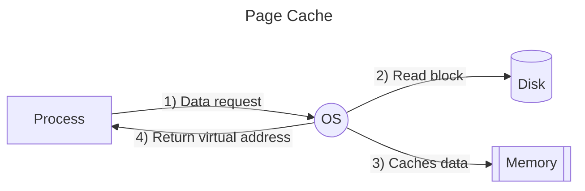
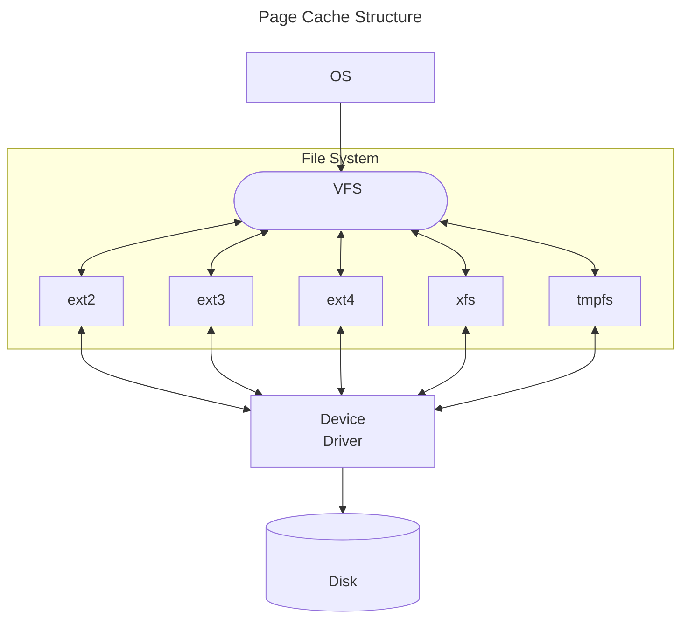

# Chapter3)<br> OS 캐시와 분산

`🗓️ 2024.06.09` ` 👩🏻 황진주 `
> 총평 :
> OS에 대해 아는 것이 최적화에 대해 아는 것이라는 점을 확실히 알려준 챕터입니다.
> 압축 전략 및 sar 명령 사용에 더 알아보고 싶네요!

### 목차

- [Chapter3) OS 캐시와 분산](#chapter3-os-캐시와-분산)
    - [목차](#목차)
  - [페이지 캐싱](#페이지-캐싱)
    - [메모리 캐싱 과정](#메모리-캐싱-과정)
    - [캐싱을 위한 구조](#캐싱을-위한-구조)
    - [Linux 파일시스템 종류](#linux-파일시스템-종류)
  - [캐싱은 어떻게 이루어지고 있을까](#캐싱은-어떻게-이루어지고-있을까)
  - [I/O 부하 줄이기](#io-부하-줄이기)
    - [1. 캐시 전재](#1-캐시-전재)
    - [2. 복수 서버 이용](#2-복수-서버-이용)
    - [추가 인사이트](#추가-인사이트)

<br>

---

<br>

## 페이지 캐싱

> OS의 메모리와 디스크 간의 속도 차 극복을 위한 기본 개념

<br>

### 메모리 캐싱 과정



> ✔️ The process can only access memory through the OS and not directly access the disk.

1) 프로세스는 OS에게 디스크 정보를 요청한다.
2) OS는 디스크의 정보를 가져오기 전 메모리 캐싱 여부를 확인한다.
    2-1) 만일 해당 정보가 캐싱되어 있지 않다면
    2-2) 해당 정보를 메모리 공간에 저장한다.
3) OS는 메모리에서 캐싱데이터를 가져온다.
4) OS는 해당 프로세스에게 직접적인 주소가 아닌 가상 주소를 반환한다.

 \* 이 때 OS는 메모리를 일정 크기(4kb)의 블록단위로 읽어들이는데 이를 **페이지**라고 한다.

<br>

### 캐싱을 위한 구조

 > 디스크를 다루기 위해서는 어떤 요소의 상호작용이 필요할까?



- VFS : 실질적 페이지 캐시 구조, 파일 시스템의 인테페이스
- Device Driver : 실질적인 하드웨어 조작
- File System : 파일 관리 알고리즘


<br>

---

<br>


### Linux 파일시스템 종류

| **명칭** | **저널링, (메모리/파일시스템)최대 크기** | **특징** | **파일 저장 기법** | **설명** |
|:--:|:-----:|--|--|--|
| **ext**<br>(1992) | 없음<br>2GB<br>2GB | 단순 구조, 현재는 거의 미사용 | 블록 매핑 | 데이터를 고정된 크기 블록으로 나누어 저장 |
| **ext2**<br>(1993) | 없음<br>16GB - 2TB<br>2TB | 신뢰성 및 성능 향상, 플래시 메모리에서 여전히 사용 | 블록 매핑 | 데이터를 고정된 크기 블록으로 나누어 저장 |
| **ext3**<br>(2001) | 있음<br>2TB<br>4TB | 데이터 무결성 보장, ext2에서 쉽게 업그레이드 가능 | 블록 매핑 | ext2의 블록 매핑 방식을 사용하며, 저널링 추가로 데이터 무결성 보장 |
| **ext4**<br>(2008) | 있음<br>16TB<br>1EB | 저널링, 디스크 조각화 방지, 대용량 파일 지원, 고성능 | 확장 블록 매핑 | ext3의 기능 + 확장 블록 매핑을 사용으로 성능/안정성 향상 |
| **XFS**<br>(1994) | 있음<br>8EB<br>16EB | 고성능, 대용량 파일 및 파일 시스템 지원, 빠른 복구 | 확장 블록 매핑 | 대용량 파일의 효율적 관리를 위한 확장 블록 매핑 이용 |
| **tmpfs**<br>(90년대 중반) | N/A<br>메모리 크기에 따라 다름<br>메모리 크기에 따라 다름 | 휘발성, 재부팅 시 데이터 손실, 메모리 기반, 빠른 속도 | 메모리 매핑 | 데이터를 메모리에 저장 |

- **저널링?** : 시스템 충돌, 전원 장애 시의 데이터 무결성을 보장을 위한 주 파일 시스템 수정 사항 로깅

<br>

**Q. 다른 파일 시스템은 뭐 쓰죠?**

```
Windows는 NTFS, MacOS는 APFS를 사용한다. Andriod와 같은 경우 또한 리눅스 커널을 기반으로 하는 운영 체제이기 때문에 주로 ext4를 이용한다.
IoT에서는 경량 리눅스를 요구한다 주로 etx4를 이용하긴 하지만, 경우에 따라 F2FS, JFFS2, UBIFS를 이용하기도 한다. 
```

 \* 모르는 개념과 단어가 잔뜩이네요 추후 더 확인해야 할 것 같슴니다
 \* 다음에는 Windows 파일 시스템 변천사 봐도 잼나겠네요 희히
 \* IoT랑 Embedded 쪽을 제가 확실히 잘 몰랐네욤
 \* 괜찮으시다면 담에 논문 리뷰도 같이 하면 좋겠씁니다

- [좋참 : 5 Things to Consider When Choosing an Embedded File System](https://www.jblopen.com/choosing-embedded-file-system/)
- [좋참 : IoT 플랫폼에 탑재되는 안드로이드 및 리눅스 기반 파일시스템 포렌식](http://journal.dcs.or.kr/xml/36063/36063.pdf)
- [좋참 : Forensic Analysis of IoT File Systems for Linux-Compatible Platforms
](https://www.mdpi.com/2079-9292/11/19/3219)

<br>

---

<br>

## 캐싱은 어떻게 이루어지고 있을까
 > 캐싱은 일반적으로 페이지 단위로 디스크 캐싱이 일어난다.

## I/O 부하 줄이기

### 1. 캐시 전재 
 - 1.1. 데이터 규모보다 큰 물리 메모리 탑재
   - 전테 데이터에 대한 압축 알고리즘을 통한 크기 감소 고려
 - 1.2. 경제적 비용과 밸런스 고려
   - 실질적인 메모리 비용을 고려하여 하드웨어를 늘일 것인가를 고려

### 2. 복수 서버 이용

 > 전체 캐싱이라는 이상적인 상황이 아닌 경우

 - 논리 전개 
   1) 단순 물리적 서버 대수를 늘리는 것은 의미가 없음
   2) 데이터를 분할하여 각각 서버에 위치시키는 것을 고려
   3) 데이터 분할 시, 동기화 및 조회를 어떻게 할 것인가? 라는 문제 발생 (4장 내용)

### 추가 인사이트

    - 서버를 재부팅 하면 DB 내용을 한 번 cat 해줘서 캐싱하자
    - 이 이전에 성능테스트를 하면 캐싱이 되지 않아, 제대로된 지표가 나오지 않는다.